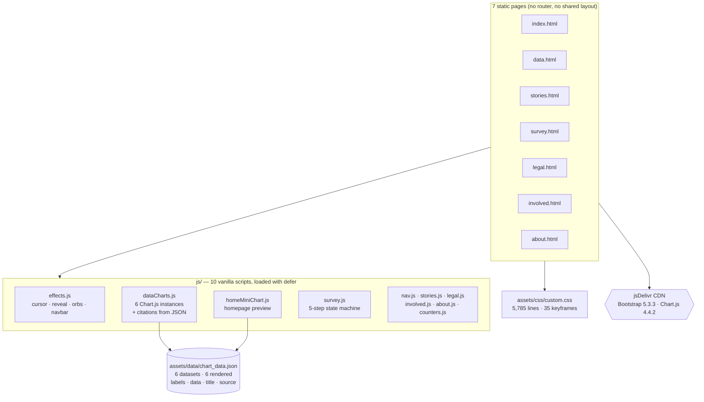

<p align="center">
  
  
</p>

<h1 align="center">Paid Internships Now</h1>

<p align="center">
  <strong>A seven-page advocacy site arguing that internships should be paid — no framework, no bundler, no build step, with the scroll choreography, the six charts and the five-step form all written by hand against a single JSON file.</strong>
</p>

<p align="center">
  <a href="https://yadava5.github.io/paid-internships-advocacy/"><strong>Live Site</strong></a> •
  <a href="#features">Features</a> •
  <a href="#architecture">Architecture</a> •
  <a href="#data-provenance">Data provenance</a> •
  <a href="#getting-started">Getting Started</a>
</p>

<p align="center">
  
  
  
  
</p>

---

## Overview

Paid Internships Now is a static, multi-page advocacy site built for **ENG109: Digital Composition** at Miami University, Oxford, Ohio. Seven HTML pages make the case that unpaid internships gate professional careers behind the ability to work for free: a data page of six scroll-driven charts, a legal page walking the FLSA and the seven-factor primary beneficiary test, twelve first-person accounts, an action page, and a five-step survey form.

It has no framework, no bundler, no package manager and no server. Bootstrap 5.3.3 and Chart.js 4.4.2 come off a CDN; everything else is 5,785 lines of hand-written CSS and ten vanilla scripts in `js/`. The repository is the deployable artifact — GitHub Pages serves the checkout as-is.

**Before you cite anything from this site, read [Data provenance](#data-provenance).** Each of the six chart datasets names the survey, the year and where applicable the table it came from, and that string — not any hand-typed prose — is the citation printed under the chart. That section lists all six verbatim.

### Why it's interesting

- **A hand-rolled 3D scroll layer.** `js/dataCharts.js`, `js/stories.js`, `js/legal.js`, `js/involved.js` and `js/about.js` each run their own `requestAnimationFrame`-throttled scroll loop that maps a section's distance from the viewport centre onto `translateZ`, `rotateX`, `scale` and `opacity`. No scroll library is used at all.
- **Charts that do not exist until you reach them.** An `IntersectionObserver` at `threshold: 0.3` constructs each `Chart` instance on first intersection and never again, guarded by a `chartsInitialized` map — six charts, six one-shot constructions.
- **One data file, two consumers.** `assets/data/chart_data.json` feeds both the data page's six charts and the homepage preview chart (`js/homeMiniChart.js`), so the two cannot drift apart.
- **The citation is rendered, not typed.** Every dataset carries a `source` string, and `renderSources()` in `js/dataCharts.js` writes it into the DOM under the matching canvas. Chart and citation resolve through the same `datasetKeys` map, so there is no way to change a number without the attribution beside it changing too — which is how an earlier version of this page came to credit figures to organisations that had never published them.
- **Motion has an off switch.** `assets/css/custom.css` carries two `@media (prefers-reduced-motion: reduce)` blocks across its 35 `@keyframes`; every page ships a skip link, and all 12 images on the stories page have alt text.
- **The honest part is documented, not hidden.** The survey that persists nothing, and the corrections still pending, are written down below rather than left for a reader to discover.

---

## Features

### Data page — six charts, one JSON file

`data.html` is six full-viewport sections, each pairing a headline with a Chart.js canvas: bar (offer rate), horizontal bar (starting salary), bar (Class of 2015 salary offers), bar (unpaid share by group), horizontal bar (the same year read by two different surveys), line (unpaid share over time).

Six datasets, six sections, six `case` labels — the JSON has nothing in it that the page does not render, and the page renders nothing the JSON does not hold.

The chart type is a claim of its own. The offer-rate chart was a doughnut and could not be: 72.2 / 43.9 / 36.5 are three independent rates, not parts of one whole, and a doughnut sizes each arc as `value / sum`, so the 72.2% slice drew at 47% of the ring. It is bars against a 0–100 axis now. The over-time line is dashed on purpose — NACE measured the Class of 2014 and the Class of 2023 on this basis and not the years between, so the segment is a connection, not a series.

### The scroll pipeline

```
scroll event (passive listener)
     │
     ▼   requestAnimationFrame, one frame in flight (`ticking` guard)
┌────────────────────────────────────────────────────────────────────┐
│  d = (sectionCentre − viewportCentre) / viewportHeight             │
│                                                                    │
│  .data-section-bg  →  translateY(d × 50px) scale(1.1)              │
│  .data-content     →  translateZ(−|d| × 80px) rotateX(d × 5deg)    │
│                       scale(max(0.9, 1 − |d| × 0.1))               │
│                       opacity(max(0.4, 1 − |d| × 0.5))             │
│  .data-text        →  translateY(d × −30px)                        │
│  .data-visual      →  translateY(d × 20px)      (counter-motion)   │
└────────────────────────────────────────────────────────────────────┘
     │
     ▼
IntersectionObserver(threshold 0.3) ──► first intersection only ──► new Chart(...)
```

The counter-motion on `.data-visual` is what produces the parallax: text and chart move in opposite directions at different rates as the section crosses the viewport centre.

### Stories

Twelve accounts across three sections (STEM, Government, Non-profit), each an accessible carousel — previous/next buttons, dot navigation, arrow keys while the section is in view, and touch swipe with a 50px threshold. **Each account is labelled on its own card as an illustrative composite written for this project, not a real individual.** They are not evidence and are not presented as evidence; the evidence is on the data page.

### Survey

`survey.html` is a five-step form with a progress bar, slider, emoji scale and rating scale. **It stores nothing.** `js/survey.js` calls `preventDefault()` and shows a thank-you panel — there is no `action`, no `fetch`, no storage and no endpoint anywhere in the repository. The page now says so: the hero's "500+ Responses" and the thank-you panel's "Your response has been recorded" were both removed rather than left standing over a form that records nothing.

### Legal

`legal.html` is the one place on the site where claims terminate in a primary source: the FLSA, DOL Fact Sheet #71 (the seven-factor primary beneficiary test), DOL Fact Sheet #14A, and the January 2023 OPM/CHCOC internship guidance memo, each linked to the issuing agency. Four state cards cover California, New York, Oregon and Illinois; three of those four source links are dead (see below).

### Get involved

Four actions: an Action Network petition, a copy-to-clipboard letter template for a representative, a link to the NACE position statement on US internships, and share links. The hero counters no longer claim anything about this site's own reach; two of the three are published NACE figures and carry their citation directly under the band.

---

## Architecture



### The one genuinely hard decision: per-page scroll loops instead of a shared engine

Five of the ten scripts implement the same shape — a passive `scroll` listener, an `rAF` `ticking` guard, and a per-section `distanceFromCenter` that drives a CSS transform string. They are near-duplicates of each other, and factoring them into one module is the obvious refactor.

It was not done, deliberately. Each page's transform constants differ (the stories page tilts 8 degrees and scales to 0.85; the data page tilts 5 degrees and scales to 0.9), and with no bundler a shared module would have to be a global loaded on every page — paying its parse cost on `legal.html` to serve `data.html`. The duplication buys per-page independence: a page can be edited or deleted without touching any other. The cost is real and is the first thing to fix if this site ever gains a build step.

The second consequence of no build step: **the CDN tags carry no `integrity` attribute**, on any page. The site trusts jsDelivr to serve unmodified Bootstrap and Chart.js. Subresource integrity hashes are the correct fix and are not currently present.

---

## Tech Stack

| Layer         | Choice                                                                             |
| ------------- | ---------------------------------------------------------------------------------- |
| **Markup**    | 7 hand-written HTML5 pages, no templating                                          |
| **Framework** | None. 10 vanilla scripts in `js/`, loaded with `defer`                             |
| **CSS**       | Bootstrap 5.3.3 (CDN) + `assets/css/custom.css` — 5,785 lines, 35 `@keyframes`      |
| **Icons**     | Bootstrap Icons 1.11.3 (CDN)                                                       |
| **Charts**    | Chart.js 4.4.2 (CDN) — 6 instances across 2 types (bar, line)                       |
| **Data**      | `assets/data/chart_data.json` — one file, 6 datasets, each with its own `source`    |
| **Hosting**   | GitHub Pages, serving the repository root                                          |
| **CI**        | GitHub Actions, 8 jobs — see [Testing](#testing)                                    |
| **Build**     | None. No `package.json`, no lockfile, no bundler                                    |

Versions are read from the `<script>` and `<link>` tags themselves; there is no manifest to pin them in.

---

## Data provenance

Every figure on the data page is rendered from `assets/data/chart_data.json`, and so is every citation. Each dataset carries a `source` string naming the survey, the year, and where applicable the table — and `js/dataCharts.js` prints that exact string under the canvas it belongs to.

The table below is the file's `source` column, copied verbatim. It is not a restatement of these figures as findings.

| Dataset (JSON key)     | Rendered as                          | `source` string in the file                                                                             |
| ---------------------- | ------------------------------------ | ------------------------------------------------------------------------------------------------------- |
| `offer_rate`           | Bar, data.html §1                    | NACE, Class of 2015 Student Survey — private for-profit employers only; base is students who applied      |
| `salary_comparison`    | Horizontal bar, data.html §2         | NACE 2022 Student Survey, via NACE Position Statement on Unpaid Internships (May 2023)                    |
| `salary_offers_2015`   | Bar, data.html §3                    | NACE, Class of 2015 Student Survey — private for-profit employers                                         |
| `unpaid_by_group`      | Bar, data.html §4 + homepage preview | NACE, The Class of 2023: Inequity Continues to Underpin Internship Participation and Pay Status, Table 2  |
| `unpaid_by_instrument` | Horizontal bar, data.html §5         | NACE Class of 2023; CCWT/Strada National Survey of College Internships 2023 (June 2024), Tables A16-A17   |
| `unpaid_over_time`     | Line, data.html §6                   | NACE Class of 2014 Student Survey; NACE Class of 2023                                                     |

Three further facts a reader should have:

1. **The citation is generated, and that is the point.** There is no hand-written citation in `data.html` any more. A `<p class="chart-source">` is created at runtime from the dataset's own `source`, through the same `datasetKeys` map that selects the numbers, so a figure and its attribution cannot be edited apart. The previous version of this page hand-typed its citations beside numbers drawn from the JSON, and that gap is precisely how it came to attribute invented figures to Harvard and the Federal Reserve.
2. **These are survey instruments, not censuses, and they disagree.** §5 exists to say so: NACE puts the Class of 2023's unpaid share at 40.8%, while the National Survey of College Internships puts the same year at 31% (four-year) and 50% (two-year). Any single decimal figure for "the unpaid share" is one instrument's answer, not a settled fact.
3. **The twelve accounts on `stories.html` are a separate question from the charts.** They are not sourced from this JSON and are not covered by anything above.

`source` names a survey, a year and a table. It does not carry a URL, so the last step of a citation — resolving it to a page — is still a search rather than a click. That is the remaining gap here.

### Corrections pending on the live site

Found by comparing the rendered pages against the data file they claim to render. Six of the seven originally recorded here were fixed in the data-page rebuild: the unsourceable datasets were deleted rather than softened, the hero counter now matches the JSON's $20,000 gap, the petition card reports the campaign's real count, the letter template cites NACE's Class of 2023 figures, and the survey and action-page hero bands no longer claim reach that nothing measures. What remains:

| # | Where                        | The problem                                                                                                                            |
| - | ---------------------------- | -------------------------------------------------------------------------------------------------------------------------------------- |
| 1 | `legal.html` state cards     | Three of four state source links return 404 (California DLSE, Oregon BOLI, Illinois DHR, checked 2026-08-10 with a browser user agent). The four federal links all return 200. |

---

## Testing

**There is no test suite.** No unit tests, no browser tests, no assertions of any kind exist in this repository. What exists is `.github/workflows/ci.yml`, and the honest summary of it is this: **it runs eight jobs, and four of them cannot fail.**

| Job                | Can it fail the run?                                                          |
| ------------------ | ----------------------------------------------------------------------------- |
| `html-validation`  | **No** — the job sets `continue-on-error: true`                               |
| `css-lint`         | **No** — the stylelint step ends in `\|\| true`                               |
| `link-check`       | **No** — it prints "Broken link" inside a piped `while read` and never exits non-zero |
| `accessibility`    | **No** — it emits warnings only                                               |
| `js-syntax`        | Yes — `node --check` on each of the 10 scripts, `\|\| exit 1`                  |
| `json-validation`  | Yes — `python3 -m json.tool` on the chart data, `\|\| exit 1`                  |
| `structure-check`  | Yes — 13 required paths must exist                                            |
| `build-test`       | Yes — serves the site and requires HTTP 200 from all 7 pages                   |

The final `ci-success` job depends on all eight and prints "All CI checks passed!". Four of those eight results cannot report a problem: three of the jobs exit 0 by construction, and `html-validation` sets `continue-on-error: true`, which excludes its result from the run's conclusion. A green badge on this repository would report syntax and file presence, not correctness, so there is no CI badge above.

The strongest of the four real checks is `build-test`, and it is reproducible in one command — this is the same check, run locally on 2026-08-10, and all seven pages plus the JSON and CSS returned 200:

```bash
python3 -m http.server 8099 --directory . &
for p in index.html data.html stories.html survey.html legal.html involved.html about.html \
         assets/data/chart_data.json; do
  printf '%-32s %s\n' "$p" "$(curl -s -o /dev/null -w '%{http_code}' http://localhost:8099/$p)"
done
```

What no job checks: that the numbers rendered on a page match the JSON they claim to come from. Every discrepancy in [Corrections pending](#corrections-pending-on-the-live-site) passes CI today.

---

## Implemented vs delegated vs planned

### Written by hand in this repository

- The scroll-transform system — passive listeners, `rAF` throttling, `distanceFromCenter` maths and the transform strings, across five page scripts.
- All six Chart.js configurations: axis callbacks, tooltip formatters, per-chart colour logic and animation config — plus `renderSources()`, which builds each citation element from the dataset it belongs to.
- The five-step survey state machine (`js/survey.js`): step transitions, progress bar, slider fill, and per-control selection feedback.
- The stories carousel: buttons, dots, arrow keys gated on an `IntersectionObserver`, and touch swipe.
- `assets/css/custom.css` — 5,785 lines, 35 `@keyframes`, glassmorphism nav, tilt cards, custom cursor and two reduced-motion blocks.
- The animated counters (`js/counters.js`, plus `easeOutExpo` variants in `effects.js`, `involved.js`).

### Delegated on purpose

- **Chart rendering** — Chart.js 4.4.2 draws every scale, legend, tooltip and animation. This project configures charts; it does not draw them.
- **Layout, grid, navbar and responsive breakpoints** — Bootstrap 5.3.3. Writing a grid system to prove a point about internships would be the wrong use of the time.
- **Icons** — Bootstrap Icons 1.11.3.
- **Hosting and TLS** — GitHub Pages.

Both libraries load from jsDelivr with no `integrity` attribute, which is the security cost of having no build step (see [Architecture](#architecture)).

### Planned, not in this build

- **A URL per dataset.** `source` now names a report, a year and a table, and that string is what the page renders — but it is not a link. Adding a `url` field beside it would make a citation one click rather than one search.
- **Survey persistence.** The form collects nothing today, and the page now says so rather than claiming otherwise.
- **Subresource integrity hashes** on the four CDN resources.
- **A measured accessibility pass.** Skip links, alt text, `aria-label`s on carousel and scroll controls and reduced-motion blocks are all present, but no axe or Lighthouse run has been done, so no compliance claim is made here.

---

## Getting Started

### Prerequisites

A modern browser and Python 3 (or any static file server). There is nothing to install — no `package.json`, no dependencies, no environment variables.

### Quick start

```bash
git clone https://github.com/yadava5/paid-internships-advocacy.git
cd paid-internships-advocacy

python3 -m http.server 8080     # or: npx serve  ·  php -S localhost:8080

open http://localhost:8080
```

Use `python3`, not `python` — recent macOS ships only `python3`.

**Opening the files directly with `file://` will not work for the charts.** `js/dataCharts.js` and `js/homeMiniChart.js` `fetch` the local JSON, and browsers block `fetch` from a `file://` origin. The homepage preview chart and the entire data page render empty — including the chart citations, which are written into the DOM from that same JSON. Every other page is fine. Serve over HTTP.

| Command                                   | What it does                                        |
| ----------------------------------------- | --------------------------------------------------- |
| `python3 -m http.server 8080`             | Serve the site locally                              |
| `node --check js/*.js`                    | The same syntax check CI runs (`js-syntax`)         |
| `python3 -m json.tool assets/data/chart_data.json` | The same JSON check CI runs (`json-validation`) |

---

## Project Structure

```
paid-internships-advocacy/
│
├── index.html              # Hero, animated salary counter, 3 teaser cards, preview chart
├── data.html               # 6 full-viewport chart sections (the argument's evidence page)
├── stories.html            # 12 first-person accounts in 3 carousels
├── survey.html             # 5-step form — collects nothing, see Features
├── legal.html              # FLSA, the 7-factor test, landmark cases, 4 state cards
├── involved.html           # Petition, letter template, campaign link, share links
├── about.html              # Mission, course attribution, 4 source-organisation links
│
├── assets/
│   ├── css/custom.css      # 5,785 lines — every visual decision on the site
│   ├── data/
│   │   └── chart_data.json # 6 datasets, 6 rendered; each carries its own `source`
│   └── img/                # empty — all imagery is hot-linked from Pexels/Pixabay
│
├── js/                     # 10 scripts, no modules, no bundler, all `defer`ed
│   ├── effects.js          # cursor, scroll progress, reveal, tilt, orbs, navbar (642 lines)
│   ├── dataCharts.js       # 6 chart configs + citation rendering + scroll loop (510 lines)
│   ├── stories.js          # carousel + the stories page's scroll loop
│   ├── legal.js            # legal page scroll loop + factor-card interactions
│   ├── involved.js         # action page scroll loop, magnetic buttons, counters
│   ├── about.js            # about page scroll loop, tilt cards
│   ├── survey.js           # 5-step form state machine
│   ├── homeMiniChart.js    # homepage preview chart, reads the same JSON
│   ├── counters.js         # animated number counter (index.html)
│   └── nav.js              # active-link highlighting, scroll-to-top
│
├── docs/architecture.md    # page map, data flow, module list — 6 datasets, 6 sections
├── .github/workflows/ci.yml # 8 jobs, 4 of which cannot fail — see Testing
├── LICENSE                 # MIT
└── README.md
```

---

## Technical Decisions

**No build step, at the cost of subresource integrity.** Shipping the repository as the artifact means the site cannot break in a bundler, has no lockfile to rot, and deploys by `git push`. The price is four unpinned CDN resources — Bootstrap's CSS and JS bundle, Bootstrap Icons, Chart.js — with no `integrity` hash, and no way to add one automatically. For a seven-page site that is a defensible trade; for anything handling user input it would not be.

**One JSON file rather than numbers in the markup.** Both the data page and the homepage preview chart read `chart_data.json`, so the two cannot disagree. The earlier limitation was that only the *bars* came from the file: the citation under each chart was hand-typed prose, and a hand-typed citation beside a generated number is free to drift from it. Four of the seven corrections once recorded here were exactly that drift. The citation is now rendered from the same object as the data, which closes the mechanism rather than the individual symptoms. The headline copy in `data.html` is still hand-written prose and can still drift; the difference is that the attribution it sits beside no longer can.

**Duplicated scroll loops rather than a shared engine.** Five near-identical implementations, kept separate so each page stands alone without a global. Discussed in full under [Architecture](#architecture).

---

## Verify it

Every claim in this README terminates in a file you can open or a command you can run.

**Every dataset has a source, and every source reaches the page** — this is the check that the citation mechanism is intact:

```bash
python3 - <<'PY'
import json
d = json.load(open("assets/data/chart_data.json"))
print("datasets            =", len(d))                                  # 6
print("with a source       =", sum("source" in v for v in d.values()))  # 6
s = d["salary_comparison"]["data"]
print("paid - unpaid       =", s[0] - s[1])   # 20000 — index.html's counter animates to 20000
for k, v in d.items():
    print(f"  {k:22} {v['source']}")
PY

grep -c 'data-chart=' data.html               # 6 sections for 6 datasets
grep -o "case '[a-z0-9]*'" js/dataCharts.js   # 6 cases, one per dataset
grep -c 'class="data-source"' data.html       # 0 — no citation is hand-typed into the page
```

The last line is the one that matters. A non-zero result there means somebody has typed a citation into the markup again, beside a number that comes from the JSON, and the two are free to drift apart from that moment on.

**The CI claim** — open `.github/workflows/ci.yml` and look for `continue-on-error: true` and `|| true`. Four jobs have one or the other and cannot fail; the other four end their steps in `|| exit 1`.

**The petition count** — `curl -s <the Action Network URL in involved.html> | grep -i signature` prints the petition's own live counter. It read 1,126 on 2026-08-10.

**The legal page's sources** — these are the only claims on the site that terminate in a primary document. All four federal links return 200 (US government sites require a browser user agent; `curl` without one gets a 403):

- [DOL — Fair Labor Standards Act](https://www.dol.gov/agencies/whd/flsa)
- [DOL Fact Sheet #71 — Internship Programs Under the FLSA](https://www.dol.gov/agencies/whd/fact-sheets/71-flsa-internships) (the seven-factor primary beneficiary test)
- [DOL Fact Sheet #14A — Non-Profit Organizations and the FLSA](https://www.dol.gov/agencies/whd/fact-sheets/14a-flsa-non-profits)
- [OPM/CHCOC — Internship Guidance Memo, January 2023](https://chcoc.gov/sites/default/files/Internship%20Guidance%20Memo%201-19-2023_508.pdf)

**What you still cannot click through to:** the six chart citations name a survey, a year and a table, but carry no URL, so resolving one to its published page is a search rather than a link. The accounts on `stories.html` are a separate matter and are not sourced from the chart data.

---

## Author

**Ayush Yadav** — sole author and maintainer.
[github.com/yadava5](https://github.com/yadava5)

Built for ENG109: Digital Composition at Miami University, Oxford, Ohio.

---

## License

MIT — Copyright (c) 2025 Ayush Yadav. See [LICENSE](LICENSE) for the full terms.

Imagery is hot-linked from Pexels and Pixabay under their respective free-use licences and is not redistributed in this repository.

---

<p align="center">
  <a href="https://yadava5.github.io/paid-internships-advocacy/">yadava5.github.io/paid-internships-advocacy</a>
</p>
